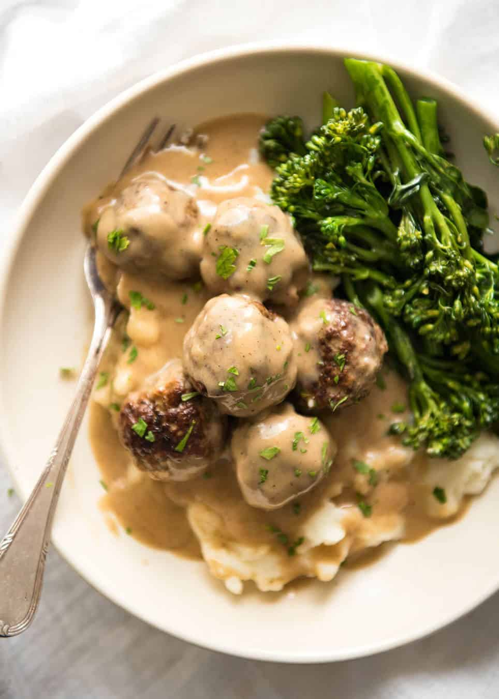
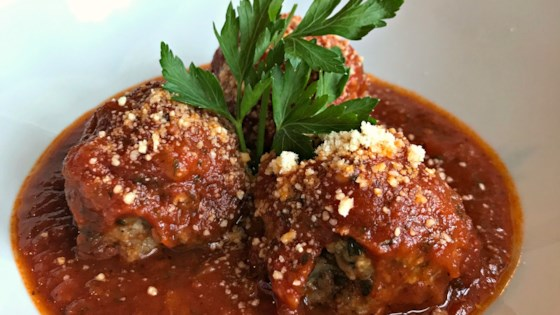

<!DOCTYPE html>
<html>
<head>
    <title>Joey's Meatballs</title>
    <meta charset="utf-8">

    
</head>
<body>
    <h1>What We Are</h1>
    <p1>We are a luxury meatball company from NYC, New York. We use the best products and meat to bring the   best quality meatballs to the US.</p1>
   
    

    <pre>Swedish Meatballs                                                             Spicy Italian</pre>
               
    <table style="width:100%">
        <tr>
            <th>Meatball</th>
            <th>Meat-Type</th>
            <th>Price per lb</th>

        </tr>
        <tr>
            <td>Swedish</td>
            <td>Pork</td>
            <td>$34.99 USD</td>
        </tr>
        <tr>
            <td>Spicy Italian</td>
            <td>Beef</td>
            <td>$29.99 USD</td>
        </tr>
    </table>
    <a href="https://amazon.com/joey.s.meatballs/html/">Click Here to Checkout our NEW Amazon Store</a>
    <h2>Reviews</h2>
    
Susan Milluzinkowksi says, <q>I love these meatballs, they made me happy again.</q>

    
Joseph Robinson says, <q>I do not really eat meat, I do not really eat vegetables; they're too healthy, I eat cheezits.</q>

</body>
</html>
